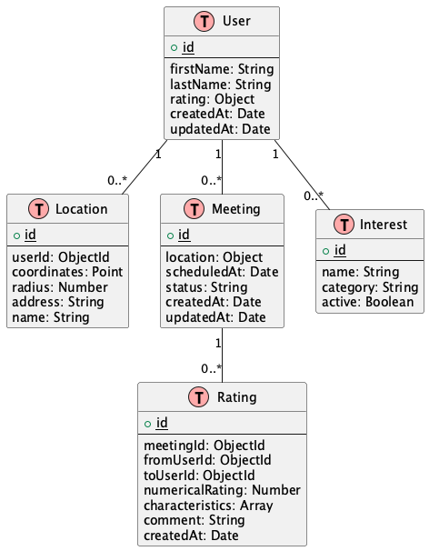
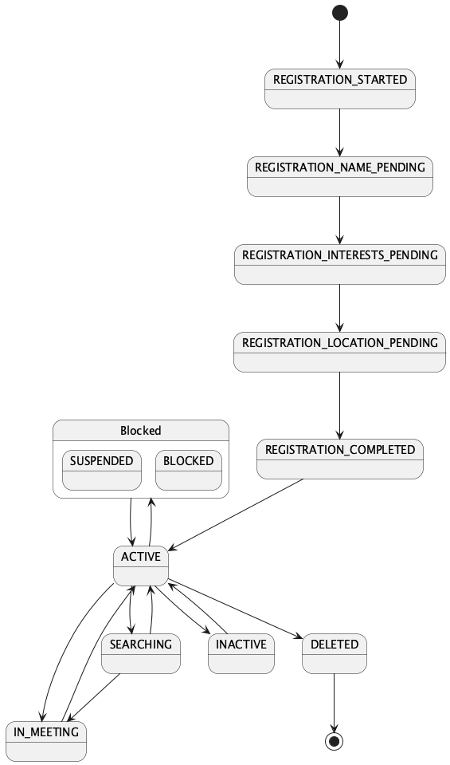

# 5. Проектирование модели данных

## Статус

Принято

## Контекст

Необходимо спроектировать модель данных для хранения:
- Информации о пользователях и их локациях
- Системы оценок и встреч
- Состояний пользователей и очередей задач

Основные сущности:
- Пользователь (User)
- Локация (Location)
- Оценка (Rating)
- Встреча (Meeting)
- Интерес (Interest)
- Состояние пользователя (UserState)

## Решение

### Основные данные в PostgreSQL

```sql
-- Users
CREATE TABLE users (
    id SERIAL PRIMARY KEY,
    first_name VARCHAR(255) NOT NULL,
    last_name VARCHAR(255) NOT NULL,
    rating_avg DECIMAL(3,2) DEFAULT 0,
    rating_count INTEGER DEFAULT 0,
    created_at TIMESTAMP WITH TIME ZONE DEFAULT CURRENT_TIMESTAMP,
    updated_at TIMESTAMP WITH TIME ZONE DEFAULT CURRENT_TIMESTAMP
);

-- Locations
CREATE TABLE locations (
    id SERIAL PRIMARY KEY,
    user_id INTEGER REFERENCES users(id),
    coordinates GEOGRAPHY(POINT) NOT NULL,
    radius INTEGER NOT NULL, -- в метрах
    address TEXT NOT NULL,
    name VARCHAR(255), -- опционально, например "Работа" или "Дом"
    created_at TIMESTAMP WITH TIME ZONE DEFAULT CURRENT_TIMESTAMP
);

-- Interests (справочник)
CREATE TABLE interests (
    id SERIAL PRIMARY KEY,
    name VARCHAR(255) NOT NULL UNIQUE,
    category VARCHAR(255),
    active BOOLEAN DEFAULT true,
    created_at TIMESTAMP WITH TIME ZONE DEFAULT CURRENT_TIMESTAMP
);

-- User Interests (связь many-to-many)
CREATE TABLE user_interests (
    user_id INTEGER REFERENCES users(id),
    interest_id INTEGER REFERENCES interests(id),
    created_at TIMESTAMP WITH TIME ZONE DEFAULT CURRENT_TIMESTAMP,
    PRIMARY KEY (user_id, interest_id)
);

-- Meetings
CREATE TABLE meetings (
    id SERIAL PRIMARY KEY,
    location GEOGRAPHY(POINT) NOT NULL,
    address TEXT NOT NULL,
    scheduled_at TIMESTAMP WITH TIME ZONE NOT NULL,
    status VARCHAR(50) NOT NULL, -- 'pending', 'confirmed', 'completed', 'cancelled'
    created_at TIMESTAMP WITH TIME ZONE DEFAULT CURRENT_TIMESTAMP,
    updated_at TIMESTAMP WITH TIME ZONE DEFAULT CURRENT_TIMESTAMP
);

-- Meeting Participants (связь many-to-many с доп. информацией)
CREATE TABLE meeting_participants (
    meeting_id INTEGER REFERENCES meetings(id),
    user_id INTEGER REFERENCES users(id),
    status VARCHAR(50) NOT NULL, -- 'pending', 'accepted', 'rejected', 'completed'
    created_at TIMESTAMP WITH TIME ZONE DEFAULT CURRENT_TIMESTAMP,
    updated_at TIMESTAMP WITH TIME ZONE DEFAULT CURRENT_TIMESTAMP,
    PRIMARY KEY (meeting_id, user_id)
);

-- Ratings
CREATE TABLE ratings (
    id SERIAL PRIMARY KEY,
    meeting_id INTEGER REFERENCES meetings(id),
    from_user_id INTEGER REFERENCES users(id),
    to_user_id INTEGER REFERENCES users(id),
    numerical_rating INTEGER CHECK (numerical_rating BETWEEN 1 AND 5),
    comment TEXT,
    created_at TIMESTAMP WITH TIME ZONE DEFAULT CURRENT_TIMESTAMP,
    UNIQUE (meeting_id, from_user_id, to_user_id)
);

-- Rating Characteristics (связь many-to-many)
CREATE TABLE rating_characteristics (
    rating_id INTEGER REFERENCES ratings(id),
    characteristic VARCHAR(255) NOT NULL,
    PRIMARY KEY (rating_id, characteristic)
);
```

### Индексы

```sql
-- Геопространственные индексы
CREATE INDEX idx_locations_coordinates ON locations USING GIST (coordinates);
CREATE INDEX idx_meetings_location ON meetings USING GIST (location);

-- Индексы для внешних ключей
CREATE INDEX idx_locations_user_id ON locations(user_id);
CREATE INDEX idx_user_interests_user_id ON user_interests(user_id);
CREATE INDEX idx_user_interests_interest_id ON user_interests(interest_id);
CREATE INDEX idx_meeting_participants_meeting_id ON meeting_participants(meeting_id);
CREATE INDEX idx_meeting_participants_user_id ON meeting_participants(user_id);
CREATE INDEX idx_ratings_meeting_id ON ratings(meeting_id);
CREATE INDEX idx_ratings_from_user_id ON ratings(from_user_id);
CREATE INDEX idx_ratings_to_user_id ON ratings(to_user_id);

-- Составные индексы для частых запросов
CREATE INDEX idx_meetings_status_scheduled_at ON meetings(status, scheduled_at);
CREATE INDEX idx_meeting_participants_status ON meeting_participants(status, user_id);
```

### Состояния и очереди в Deno KV

Для хранения быстро меняющихся данных и состояний используется Deno KV:

```typescript
// Ключ в формате users:<telegram_user_id>
type StateKey = `users:${number}`

// Значение
interface UserState {
  state: UserStateEnum;
  lastUpdated: Date;
  context?: Record<string, unknown>;
}

// Возможные состояния
enum UserStateEnum {
  // Состояния регистрации
  REGISTRATION_STARTED = 'registration_started',
  REGISTRATION_NAME_PENDING = 'registration_name_pending',
  REGISTRATION_INTERESTS_PENDING = 'registration_interests_pending',
  REGISTRATION_LOCATION_PENDING = 'registration_location_pending',
  REGISTRATION_COMPLETED = 'registration_completed',
  
  // Активные состояния
  ACTIVE = 'active',           // Обычное активное состояние
  IN_MEETING = 'in_meeting',   // Пользователь сейчас на встрече
  SEARCHING = 'searching',     // Пользователь ищет встречу
  
  // Специальные состояния
  BLOCKED = 'blocked',         // Заблокирован администратором
  SUSPENDED = 'suspended',     // Временно приостановлен
  INACTIVE = 'inactive',       // Неактивен (давно не заходил)
  DELETED = 'deleted'          // Удален
}
```

#### Управление состояниями

1. Восстановление состояний:
```typescript
async function recoverUserState(userId: number): Promise<void> {
  const state = await getUserState(userId);
  if (!state) {
    // Если состояние не найдено в кэше, пробуем восстановить из БД
    const user = await db.users.findOne({ id: userId });
    if (user) {
      // Устанавливаем базовое состояние на основе данных пользователя
      await updateUserState(userId, UserStateEnum.ACTIVE);
    }
  }
}
```

2. Обновление состояния:
```typescript
async function updateUserState(userId: number, newState: UserStateEnum, context?: Record<string, unknown>) {
  await kv.set(['users', userId], {
    state: newState,
    lastUpdated: new Date(),
    context
  });
}
```

### Диаграммы

#### ER-диаграмма основных данных



#### Диаграмма переходов состояний



## Последствия

### Положительные
- Нормализованная структура основных данных
- Эффективная работа с геоданными через PostGIS
- Быстрый доступ к состояниям через Deno KV
- Поддержка ACID транзакций для критичных данных
- Возможность сложных JOIN запросов для подбора пар

### Отрицательные
- Более сложные запросы по сравнению с документной моделью
- Необходимость явных миграций при изменении схемы
- Возможность потери состояний при сбое кэша
